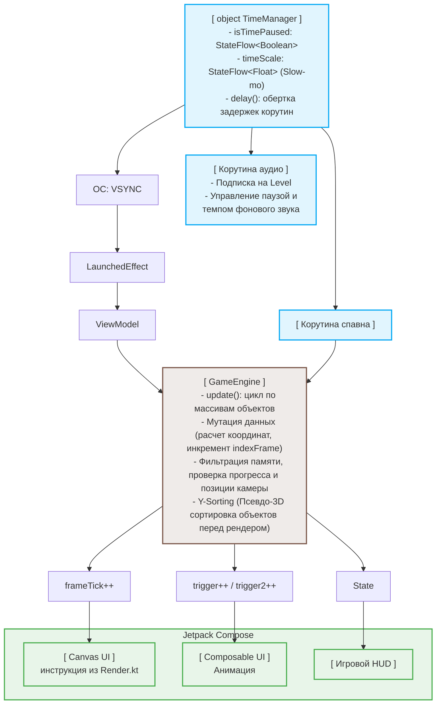

# ShaitanBuster 🩸
Мясной 2.5D шутер на native Android.
## Стек:
Kotlin, Jetpack Compose, Kotlin Coroutines, Flow, Room, Datastore, SoundPool, MediaPlayer, 
### 🏗 Архитектура движка

```mermaid
graph TD
    %% Слой Менеджера Времени
    TM["[ object TimeManager ]
    - isTimePaused: StateFlow&lt;Boolean&gt;
    - timeScale: StateFlow&lt;Float&gt; (Slow-mo)
    - delay(): обертка задержек корутин"]
    
    %% Потоки управления от TimeManager
    TM --> VSYNC["ОС: VSYNC"]
    TM --> SpawnCoroutine["[ Корутина спавна ]"]
    TM --> AudioCoroutine["[ Корутина аудио ]
    - Подписка на Level
    - Управление паузой и
    темпом фонового звука"]
    
    %% Цепочка отрисовки кадра
    VSYNC --> LE["LaunchedEffect"]
    LE --> VM["ViewModel"]
    VM --> GE
    
    %% Связь корутины спавна с движком
    SpawnCoroutine --> GE
    
    %% Внутренности GameEngine
    GE["[ GameEngine ]
    - update(): цикл по массивам объектов
    - Мутация данных (расчет координат, инкремент indexFrame)
    - Фильтрация памяти, проверка прогресса и позиции камеры
    - Y-Sorting (Псевдо-3D сортировка объектов перед рендером)"]
    
    %% Выходные триггеры движка
    GE --> FT["frameTick++"]
    GE --> TRG["trigger++ / trigger2++"]
    GE --> ST["State"]
    
    %% Слой Jetpack Compose
    subgraph JC ["Jetpack Compose"]
        CUI["[ Canvas UI ]
        инструкция из Render.kt"]
        COMP["[ Composable UI ]
        Анимация"]
        HUD["[ Игровой HUD ]"]
    end
    
    %% Связи триггеров с UI
    FT --> CUI
    TRG --> COMP
    ST --> HUD

    %% Стилизация блоков для красоты на GitHub
    classDef manager fill:#e1f5fe,stroke:#03a9f4,stroke-width:2px;
    classDef engine fill:#efebe9,stroke:#795548,stroke-width:2px;
    classDef compose fill:#e8f5e9,stroke:#4caf50,stroke-width:2px;
    
    class TM,AudioCoroutine,SpawnCoroutine manager;
    class GE engine;
    class CUI,COMP,HUD,JC compose;
```
